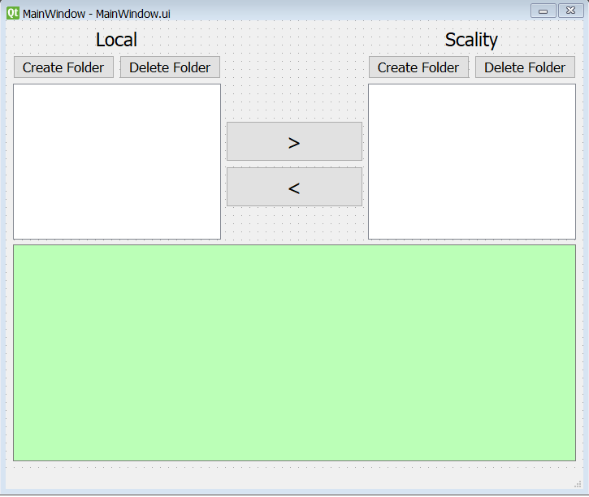

# s5cmd GUI
No Amazone S3 userinterface was found that utilizes the high transfer speeds of the [s5cmds](https://github.com/peak/s5cmd). When copying files and folder a typo is easily made, sending your data somewhere else or deleting the wrong folder, whoops. 

This gui is created to provide less technical user a way to interact with the s3 storage through the fast s5cmds. Next to this it helps the more experience users avoid mistakes by handeling the path differences between the operatingsystems, S3 and the s5cmd. The QT designer and modular setup make this tool highly customizable.

<p align="center">

</p>
The project contains both the application, s5cmd_gui, and the build scripts, scripts folder. The build scripts and be used to create standalone executables for distribution and to run on machines without python. 

Important notes:
- Build and tested with python 3.11.9 on windows, does not support other OSes at the moment
- Package is not activitely maintained
- s5cmd sync functionally is bugged, therefore only the copy is supported 
- opening folders with thousands of files in the explorer takes minutes, this a nown issue.


## Setup
The script requires an AWS confiuration and an environment file to run. The following chapters describe how to set this up.

### AWS CLI
This tool uses the AWS libraries to communicate with scality, at the moment of writing this has the best performance. 
The easiest way to create the AWS profile is through the CLI:
The AWSCLI can be downloaded from: https://awscli.amazonaws.com/AWSCLIV2.msi
After installation it has to be configured as follows:

1. Configure profile, only needs key & secret key.
```
aws configure --profile <profilename>
```
2. To increase the upload speed, set the profile concurrent requests
```
aws configure set s3.max_concurrent_requests 20 --profile <profilename>
```
The configuration is stored in  ~/.aws  

Alternatively the files can be created by hand:
1. `C:\Users\<username>\.aws\config`
with:  
```
[profile <profilename>]
s3 = 
 max_concurrent_requests = 20
```
2. `C:\Users\<username>\.aws\credentials`
```
[<profilename>]
access_key_id = 
aws_secret_access_key=
aws_access_key_id = 
```
For each profile.


### Configuration
The configuration is stored in an environment `.env` file. this file is stored in the project folder, not the `s5cmd_gui` subfolder and contains the following fields:
```
BUCKETNAME = name of the scality bucket
BUCKETSIZE = Total size of the scality bucket
ENDPOINT = Endpoint of the scality instance
AWS_PROFILE = Name of the AWS profile used for this program (traitseeker)
SOURCE_FOLDER = folder to copy from, can be local or scality
DESTINATION_FOLDER = folder to copy to, can be local or scality
DELETE_SOURCE = 'Y' to delete the data in the source after a succesfull transfer. 'N' otherwise.
```